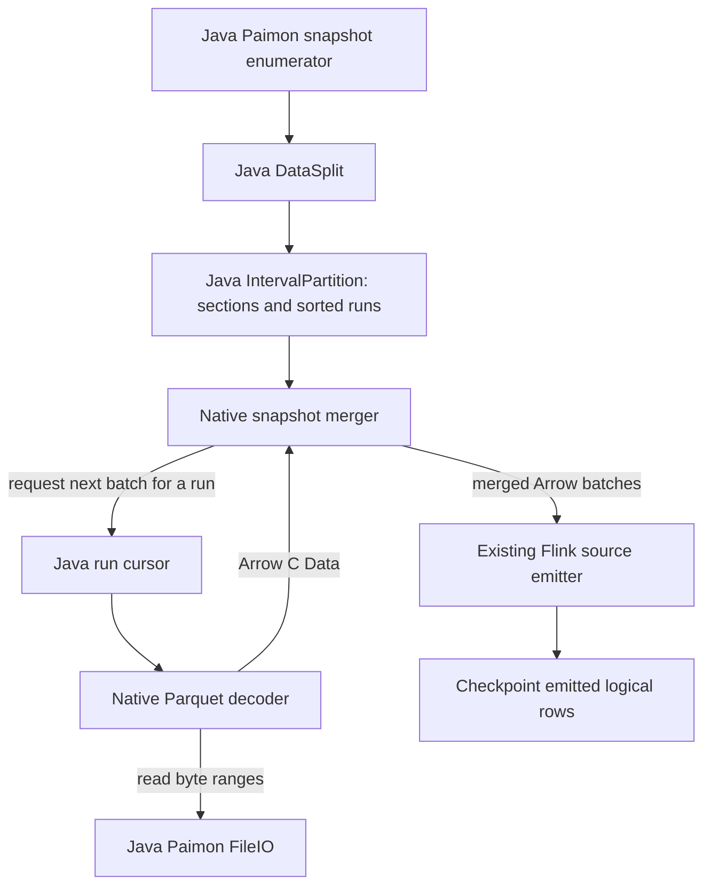

# Native Paimon snapshot merging with Java file planning

Draft, 2026-09-13. Design for the proposed boundary in
[#53](https://github.com/datafusion-contrib/StreamFusion/issues/53). This is a design and API
feasibility check; native snapshot merging is not implemented or benchmarked yet. The shipped
source still uses Java for primary-key initial snapshots.

## Proposed flow



Java continues to choose the snapshot, files, partitions and buckets; resolve schemas and
options; own filesystem credentials; assign splits; and serialize checkpoint state. Rust decodes
Parquet and merges versions. Java forwards buffer addresses without materializing file contents
as Java rows or Java Arrow vectors. Final output is imported into the existing `ArrowBatch`.

## Java can supply the merge plan using released APIs

Released Paimon 2.0.0 exposes all of these methods publicly. The metadata-only core is:

```java
var store = primaryKeyTable.store();
var sections =
    new IntervalPartition(split.dataFiles(), store.newKeyComparator()).partition();
var keys = new RowType(
    PrimaryKeyTableUtils.PrimaryKeyFieldsExtractor.EXTRACTOR
        .keyFields(primaryKeyTable.schema()));
var internalSchema = KeyValue.schema(keys, requiredValueColumns);
// Each section is List<SortedRun>; each run exposes files().
```

Sections have disjoint key ranges and can be processed sequentially. Runs in a section overlap
and must be merged. Files inside a run have strictly ordered, disjoint key ranges and can be
opened one at a time. Preserve Java's returned section, run and file ordering; do not concatenate
all files in a split into one stream. Partition columns are handled by Paimon's trimmed key
schema, not by assuming every declared primary-key column is a stored key column.

The proposed plan contains:

| Field | Purpose |
|---|---|
| Split identity and snapshot ID | Retain the enumerator's existing ownership and recovery unit |
| Ordered sections, runs and file descriptors | Lazy file opening with Java's merge grouping |
| Per-file path, length, schema ID and level | Storage access, compatibility checks and future merge policies |
| Internal Arrow schema and physical field names | Stored keys, `_SEQUENCE_NUMBER`, `_VALUE_KIND`, required values |
| Key, sequence, kind and output column indices | Explicit interpretation of each input batch |
| Validated merge policy and ordering options | No second table-options parser in Rust |
| Batch and memory limits | Admission and accounting before readers start producing output |

Decode all stored key fields even when SQL projects them away. Add fields required by the merge
policy, then apply the requested value-column projection after merging. Retain the source's
current residual-filter policy: non-key predicates must not remove a newer version before an
older version is merged with it.

## Interface sketch

Keep the merger in the optional Paimon integration, with its own native library. Parquet remains
a format module. Do not add Paimon's schema manager or storage client to either the format
library or the connector-neutral engine. This adds build/resource wiring to `streamfusion-paimon`
but does not add a second deployment artifact beyond that module's existing JAR.

```java
// Proposed API, not an existing implementation.
long createSnapshotMerger(
    SnapshotMergeSpec spec, RunBatchProvider inputs, long inputSchemaAddress);
boolean snapshotMergerNext(long handle, long arrayAddress, long schemaAddress);
void closeSnapshotMerger(long handle);

interface RunBatchProvider extends AutoCloseable {
  // Synchronously fills caller-owned empty Arrow C structs. false means end of run.
  boolean nextRunBatch(int runId, long arrayAddress, long schemaAddress);
}
```

Create one merger per section. Its run provider opens each Java-planned file lazily through the
existing `NativePaimonParquetReader`, extended with an export-only method. That method forwards
the addresses to `NativeParquet.parquetDecoderNext`; it bypasses the current Java vector import.
At file EOF the provider closes that reader and opens the next file in the same run. At run EOF
it returns false with both C structs released/empty.

The Rust adapter exposes one sorted Arrow stream per run to the extracted merger. Poll these
streams on the source fetcher's current JNI thread; their batch callbacks and byte reads are
synchronous. No Tokio worker pool or background use of a borrowed `JNIEnv` is needed. The outer
Flink source already supplies asynchronous fetching and a bounded handover queue.

The merger allocates empty C structs, calls Java, and imports the resulting Arrow arrays. It
never dereferences a Parquet decoder's Rust handle: decoder handles belong exclusively to their
own native library. C Data release callbacks free buffers in the library that allocated them.
On an exception, release any partially populated structs and propagate the original failure.
Closing the split drops merge state and closes every run reader; already emitted batches retain
their own buffer ownership. Cancellation checks belong between batch pulls, and the Java storage
client's timeouts still govern an in-flight byte read.

There is a JNI callback per input batch plus the existing byte-range callbacks. Input Arrow
buffers transfer without a row conversion. The merge's final `interleave` gathers surviving rows
into output buffers; the complete operation is not a promise of zero copies.

## What to reuse from paimon-rust

Extract the sorted cursors, Arrow key comparison, loser-tree traversal and column-wise output
gathering from `table/sort_merge.rs`, together with their tests. Its input is already a vector of
Arrow batch streams. Both repositories use Arrow 58. Adapt crate-local errors and stream aliases
to StreamFusion, retaining Apache attribution and a pinned provenance reference.

Do not import `KeyValueFileReader`, `DataFileReader`, their schema manager, OpenDAL client or
split planner. Those responsibilities already have owners here. The merger is crate-private, so
this is source extraction and adaptation, not a public `paimon` crate import or a Git/path build.

Two semantic adaptations are required even for deduplication:

- Paimon 2.0.0 orders equal keys using sequence comparisons before its reducer sees them.
  paimon-rust groups by key and resolves sequence ties using its stream traversal order. Verify
  exact ties against the released Java implementation; copying the Rust tie rule is not evidence
  of Java parity. Start with the default Java sort engine; other engines need separate admission.
- The Rust merger normally projects away system columns. Carry the winning row kind into
  StreamFusion's hidden Arrow kind column. Java's snapshot reader drops winning retracts and
  exposes the surviving value kind; do not assume every surviving row can be relabeled INSERT.

## Memory and recovery

The upstream Rust merger collects all versions of the current key and retains source batches
until output is flushed. Many versions of one key, or a long sequence of deleted keys, can retain
far more memory than one batch per input. Adapt deduplication to keep a running winner and reclaim
unreferenced batches as input advances, including when no output rows are produced. Bound retained
output references by both bytes and rows, and materialize output when that budget is reached.

Opening one file per run limits open readers, not total bytes. Parquet compressed column chunks,
decode buffers, Arrow key encodings, winners and pending output all need accounting. Preflight
each split's run fan-in and file metadata against admission limits; inspect footer requirements
before committing to a native path when needed. Retain Java reading for splits the initial
implementation cannot safely budget, including those needing Paimon's spill merge. Exact native
byte limits and their integration with allocator accounting remain implementation work. A row
batch size or a cap on run count alone must not be described as a hard memory bound.

Keep checkpoint offsets as emitted *merged logical rows*, counted after delete removal and
before downstream SQL filtering. A restart replans the same serialized split, replays its merge,
skips exactly that many logical rows across sections, then resumes emission. It does not skip
that many versions in each input file. Batch size may change across recovery. Initial recovery
cost is proportional to the replayed prefix; per-run seek checkpoints can be a later optimization.

Output order and tie resolution must match Java within each split, including when restoration
switches between the Java and native snapshot paths. Independent bucket splits may interleave.
Do not checkpoint native pointers, open streams, or prefetched merge cursors. Do not switch to
Java halfway through an emitting split after a resource or decode failure; fail the attempt and
recover from the emitted checkpoint. Compatibility fallback is chosen before that split emits.

## First implementation and acceptance

The first increment targets initial snapshot `DataSplit`s for ordinary fixed-bucket primary-key
tables using deduplication, current-schema Parquet files, default sequence behavior and the
default sort engine. Require the existing streaming-source admission as well. Keep non-default
delete handling, user sequence fields, dynamic/postpone buckets, other merge engines, historical
schemas, deletion vectors and specialized splits on the current Java snapshot path until each
combination has parity tests. Existing native changelog tailing continues after snapshot catch-up.
Batch SQL remains stock Paimon.

1. Add the optional native merger and export-only Parquet batch callback. Import the focused
   paimon-rust components and adapt deduplication ownership, ordering and row-kind output.
2. Add Java section/run planning and conservative snapshot admission. Connect it to the existing
   split reader without changing the enumerator or its serializers.
3. Compare against released Java on overlapping runs, multiple files per run, empty input, keys
   split across batches, deletes/reinserts, exact sequence ties, partitioned keys, projections
   omitting keys and nested values. Include current native-written and stock-written files.
4. Checkpoint mid-snapshot, restart with a different batch size, and test Java/native restoration
   in both directions. Run streaming SQL through the transition to later changelog commits.
5. Stress one key with many versions, long delete-only stretches, many overlapping runs, wide
   values and cancellation/error cleanup. Assert measured memory limits before widening admission.
6. Benchmark snapshot catch-up with release native libraries against the current Java
   merge-to-Arrow path, including FileIO, decoding, merging and final Arrow import. Repeat at
   different run counts and update depths; separately check steady-state tailing for regressions.

Extend the same interface to sequence-aware deduplication, first-row, partial-update and aggregate
merging only as their Java parity is proven. Import the corresponding field aggregators when that
coverage is implemented; their projection and memory requirements are larger than deduplication's.

## Feasibility evidence and references

The released `paimon-flink-2.2:2.0.0` JAR was inspected with `javap`. A scratch Java probe compiled
and ran against that artifact and existing StreamFusion fixtures. Two committed writes with
compaction disabled yielded 2 snapshot splits, 2 sections, 4 runs and 4 files (maximum fan-in 2).
Every planned file appeared exactly once, and Java's `SortedRun.validate` passed. The extracted
internal schema included `_KEY_id`, `_SEQUENCE_NUMBER`, `_VALUE_KIND` and the value fields.
This confirms the Java planning interface on real files; it does not validate a native merger.

- Java reference: Paimon 2.0.0 RC10 commit
  [`604e6d5e`](https://github.com/apache/paimon/tree/604e6d5e131c74a8d127333a2a3ad6d0319732bf),
  `MergeFileSplitRead`, `IntervalPartition`, `SortedRun`, `PrimaryKeyTableUtils`, `KeyValue`,
  `SortMergeReaderWithLoserTree`, `DropDeleteReader` and `ValueContentRowDataRecordIterator`.
- Rust reference: paimon-rust commit
  [`68244878`](https://github.com/apache/paimon-rust/blob/6824487813c69b1d4975e1add8c37343b3ead75b/crates/paimon/src/table/sort_merge.rs).
  The private Arrow-stream boundary is sufficient for extraction; API stability and parity are
  not implied by that fact.
- Existing StreamFusion source: [`db3b9529`](https://github.com/datafusion-contrib/StreamFusion/commit/db3b9529),
  especially the host FileIO decoder, split reader and emitted-row checkpoint state.
- Comet `NativeUtil.scala` informs borrowed C structs and partial-failure release. Arroyo's
  filesystem source informs columnar batch flow. Java remains the Paimon lifecycle owner as
  recorded in [divergence 37](../../divergences/37-paimon-streaming-source-java-snapshot-merge.md).

The design has a usable boundary on both sides. The remaining proof is an executable merge
adapter with Java ordering parity and bounded retention, followed by a release catch-up benchmark.
